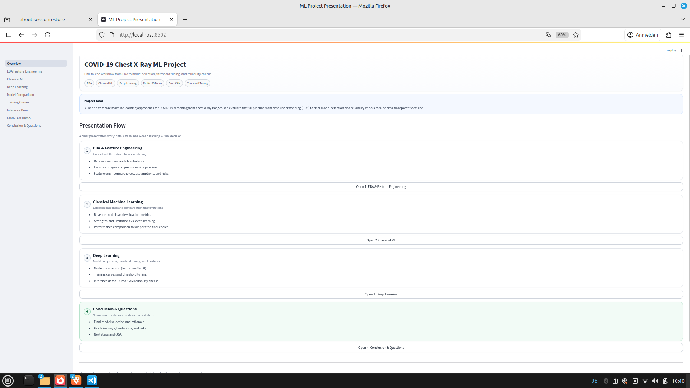
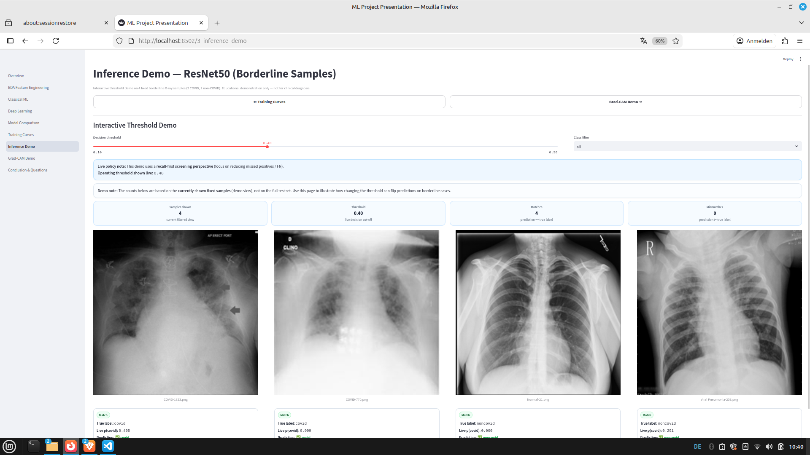
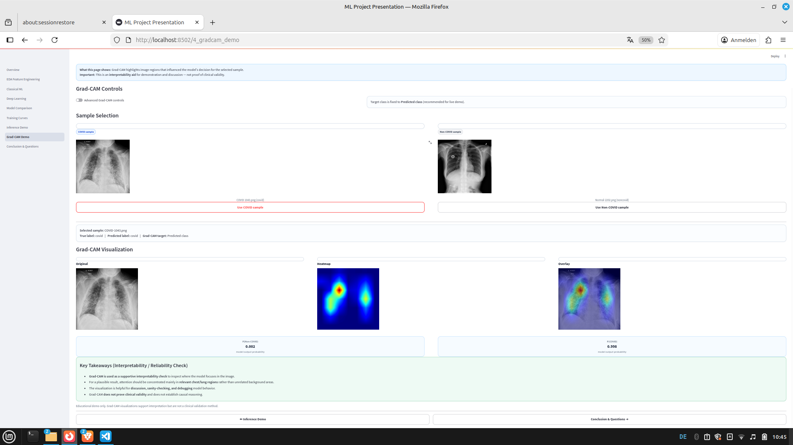
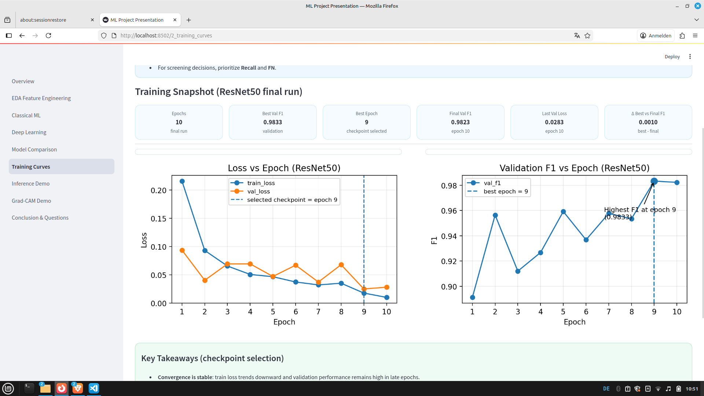

# chest-xray-ml-demo
# Chest X-ray Classification (COVID vs Non-COVID)

End-to-end ML demo project: training + evaluation + decision thresholding + Grad-CAM explainability + Streamlit demo.  
**Educational/demo use only — not for clinical diagnosis.**

## What’s inside
- **Modeling:** Custom CNN (ProCNN) + transfer learning benchmark (e.g., ResNet50)
- **Evaluation:** Precision / Recall / F1, Macro-F1 + **threshold optimization** (high-recall screening mindset)
- **Explainability:** Grad-CAM to visualize model attention
- **Demo App:** Streamlit app with sample images / upload and threshold slider
- **Artifacts:** CSV exports for probabilities/results (optional)

## Demo (Streamlit)

### Key pages
**Inference (Threshold demo)**  

**Grad-CAM (Explainability)**  

**Model Comparison / Training Curves**  

